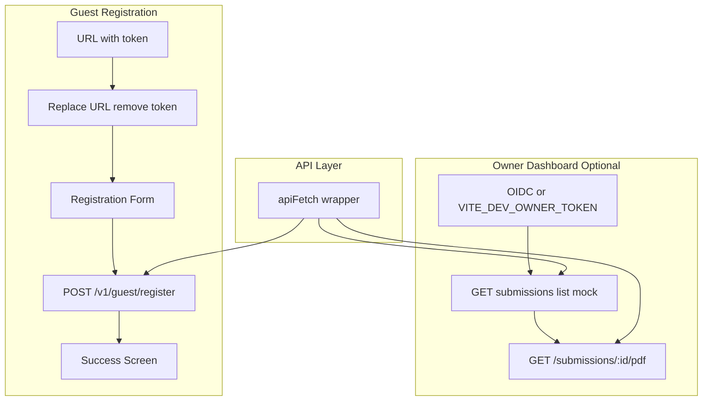

# Agent 8: Guest & Owner Frontend / UI (MVP + Production Hardening)

## Current State

**Backend APIs (existing):**

- `POST /v1/guest/register` — Auth: Bearer token (preferred; x-guest-token fallback only if needed); Body: `{ payload }`; 202 success; 401/409/500 errors (exact shapes may vary—UI normalizes)
- `GET /v1/owner/submissions/:id/pdf` — Auth: Bearer owner JWT; returns binary PDF or 401/403/404/500/502 (generic handling)

**Backend APIs (missing — to mock):**

- `GET /v1/owner/properties/:propertyId/submissions` — submissions list
- Guest token issuance (Agent 2) — create link/QR flow

**Backend constraints:** `cors({ origin: false })` — use Vite dev proxy to avoid CORS. No backend logic changes.

---

## Architecture



---

## EPIC A — Frontend scaffolding

### A1. Create frontend app

- Create Vite + React + TS project under [frontend/](frontend/)
- Add Tailwind CSS, React Router, zod
- Folder structure:
  ```
  frontend/
  ├── src/
  │   ├── pages/        # Route pages
  │   ├── components/   # Button, TextField, ErrorSummary, Spinner
  │   ├── api/          # client, contracts, errors
  │   ├── schemas/      # zod schemas
  │   └── utils/        # getTokenFromUrl, etc.
  ├── public/
  └── index.html
  ```
- Vite config: proxy `/api` to backend for dev (avoids CORS)

### A2. Env + config

- Env vars: `VITE_API_BASE_URL`, `VITE_APP_BASE_URL`, optional `VITE_OIDC_*`, `VITE_DEV_OWNER_TOKEN`
- [frontend/src/config.ts](frontend/src/config.ts): read env, fail fast with clear errors for required vars

### A3. API client wrapper

- [frontend/src/api/client.ts](frontend/src/api/client.ts): `apiFetch(url, options)` with:
  - base URL from config
  - JSON parse and error extraction
  - Propagate `x-request-id` / `x-correlation-id` if backend returns it

### A4. API error normalization

- **Do not hardcode backend error shapes.** Add a normalization layer in apiFetch that handles:
  - `{ code, message, issues }` (standard)
  - `{ error: { code, message } }` (nested)
  - plain text / HTML errors (proxy, server failures)
- Normalize to `ApiError { status, code, message, fieldErrors?, requestId? }`
- [frontend/src/api/errors.ts](frontend/src/api/errors.ts): `toUserMessage(code: string): string` — centralized mapping, not scattered across pages
- Why: prevents UI churn when Agents 2/4 finalize error formats

### A5. Shared UI primitives (minimal design system)

- Single source of truth for form/validation UI:
  - `<Button />` — loading state, disabled
  - `<Field />` or `<TextField />` — label, error, accessible
  - `<ErrorSummary />` — top-level error list
  - `<Spinner />` — loading indicator
- Why: keeps accessibility and validation consistent across guest and owner flows

### API contracts (typed, resilient)

- [frontend/src/api/contracts.ts](frontend/src/api/contracts.ts): define stable interfaces
  - `RegistrationResponse`: `{ submissionId: string; status?: string }` — UI resilient if backend returns only `submissionId`
  - Other response shapes as needed
- Why: avoids runtime errors and makes future integration cleaner

---

## EPIC B — Guest registration flow (MVP)

### B0. Referrer hardening

- Add `<meta name="referrer" content="no-referrer" />` in `index.html` (or at least for the register route/layout)
- Ensure the register page does **not** load remote fonts/assets by default (use local/system fonts)
- Why: query-token leaks via referrer is a classic footgun

### B1. Token parsing + URL sanitization

- Routes: `/register/:token` (preferred) and `/register` with `?token=`
- [frontend/src/utils/token.ts](frontend/src/utils/token.ts): `getTokenFromUrl()` — read token from path param or query, then call `history.replaceState` to remove token from URL
- Use `replaceState` only once; never re-render token
- No third-party scripts on guest page; no external asset loads by default (see B0)

### B2. Registration schema + payload mapping

- [frontend/src/schemas/registration.ts](frontend/src/schemas/registration.ts):
  - `RegistrationPayloadV1` zod schema with `schemaVersion: "v1"` and fields:
    - fullName, nationality (optional), documentType (passport|id|other), documentNumber
    - dateOfBirth (optional), checkInDate, checkOutDate
    - phone, email (optional), address (optional)
  - Date ordering: `checkOutDate >= checkInDate`
  - Helpers: form state → payload; zod errors → UI field errors

### B3. Guest registration page UI

- [frontend/src/pages/Register.tsx](frontend/src/pages/Register.tsx):
  - Mobile-first layout using shared primitives (Button, Field, ErrorSummary)
  - Accessible labels, help text
  - Field-level and top-level errors
  - Sticky submit button
  - Blur + submit validation
  - **Data-entry ergonomics (implement, not just document):**
    - `inputMode="numeric"` for document number
    - `type="date"` for date fields
    - Date min/max: checkout >= checkin
    - `autocomplete="off"` for document number; thoughtful autocomplete elsewhere

### B4. Submit integration

- POST `/v1/guest/register` with `Authorization: Bearer <token>` and `{ payload }`
- Disable submit while in-flight
- Use normalized `ApiError` and `toUserMessage()` for all error displays
- Handle responses:
  - 202 → success screen (typed `RegistrationResponse`)
  - 401 → invalid/expired token screen
  - 409 → replay/already submitted
  - 400 → validation issues (use `fieldErrors` from normalization)
  - 500 / network → generic error + retry via `toUserMessage`

### B5. Guest UX polish

- aria-live for loading state
- Optional offline detection
- Back navigation: URL already sanitized, no token re-exposure

---

## EPIC C — Owner dashboard (optional MVP)

### C0. MSW passthrough config

- MSW must **mock only what's missing**, passthrough everything else:
  - Mock: `GET /v1/owner/properties/:id/submissions`, token issuance
  - Passthrough: `POST /v1/guest/register`, `GET /v1/owner/submissions/:id/pdf`
- Why: prevents "works in mock, fails in real" surprises

### C1. Owner auth wiring

- **MVP:** dev token and "already-have-JWT" mode
  - `VITE_DEV_OWNER_TOKEN` — use directly as Bearer when set
  - In-memory preferred; avoid sessionStorage by default
- **Phase 2 (future):** real OIDC flow + refresh strategy (silent refresh / PKCE) depending on IdP
- Document: OIDC scope kept contained; implement only when needed

### C2. Submissions list page

- Route: `/owner/properties/:propertyId/submissions`
- API: `GET /v1/owner/properties/:propertyId/submissions` — **mock via MSW** (not implemented in backend)
- Mock response shape: `{ submissions: [{ id, createdAt, status }] }`
- UI: table/list with submissionId, createdAt, status; actions: Download PDF
- Handle: empty, loading, 401/403/500

### C3. PDF download

- Fetch PDF via `apiFetch` → blob → `URL.createObjectURL` → `<a download>`
- Filename: `registration_<submissionId>.pdf` if no Content-Disposition
- Errors: 401/403/404/500/502 — generic handling via `toUserMessage`; no binary logging

### C4. Create guest link + QR (optional)

- Button "Create guest link"
- Call token issuance — **mock** (backend has no endpoint; Agent 2 may provide)
- Display: link (`VITE_APP_BASE_URL` + `/register/:token`), copy-to-clipboard, QR (e.g. qrcode.react)
- Warning that link is sensitive

---

## EPIC D — Testing

### D1. Unit tests (Vitest)

- Schema: required fields, date ordering, document number format
- `zodErrorsToFieldErrors()` mapping
- `getTokenFromUrl()` behavior

### D2. E2E smoke tests (Playwright)

- Guest happy path (mock 202)
- Guest replay (mock 409)
- Owner list loads (mock submissions)
- Owner download triggers blob download (mock PDF response)

---

## EPIC E — Docs + runbook

### E1. README

- How to run (dev + build)
- Required env vars
- Mock mode (MSW, mock token)
- API endpoints consumed
- Token-in-URL sanitization and PII handling notes

---

## Security / Privacy (UI-level)

- No PII in localStorage/sessionStorage
- No PII in console logs
- No third-party scripts on guest page
- Token never re-rendered after sanitization
- Input attributes: `autocomplete="off"` for document numbers; `inputMode="numeric"` for numeric fields; `type="date"` for dates; min/max for date ordering
- PDF download: blob handling only, no binary logging

---

## API Contract Summary

| Endpoint                                 | Auth             | Body/Params   | Success                    | Errors             |
| ---------------------------------------- | ---------------- | ------------- | -------------------------- | ------------------ |
| POST /v1/guest/register                  | Bearer token     | `{ payload }` | 202 `RegistrationResponse` | 401, 409, 500      |
| GET /v1/owner/submissions/:id/pdf        | Bearer owner JWT | —             | 200 binary                 | 401, 403, 404, 5xx |
| GET /v1/owner/properties/:id/submissions | Bearer owner JWT | —             | **Mock**                   | 401, 403           |
| Token issuance                           | —                | —             | **Mock**                   | —                  |

---

## Deliverables

1. `/frontend` app with guest registration flow (token-gated, mobile-first)
2. Optional owner dashboard at `/owner/*`
3. MSW mocks for submissions list and token issuance
4. Vitest unit tests + Playwright E2E
5. README with env, run instructions, and PII notes
