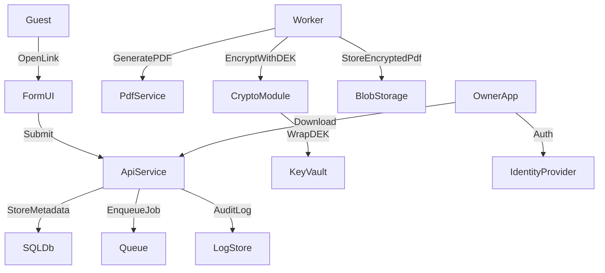

# Guest Registration Platform Plan

## Architecture & Threat Model

- **Cloud target:** Azure with Key Vault, Blob Storage, Azure SQL (or PostgreSQL on Azure), App Service/Container Apps, Azure Monitor.
- **Core services:**
  - API service for registration, validation, PDF generation, encryption, and RBAC access.
  - Background worker for PDF generation/encryption to isolate CPU work.
  - Storage for encrypted PDFs (Blob) and metadata (SQL).
  - Identity & access using JWT (Auth0/Azure AD B2C) for owners/admins; magic-link/guest tokens for forms.
- **Multi-tenant isolation:** TenantId on every row; tenant-scoped queries; per-tenant access policies; storage prefix partitioning by TenantId.
- **Threat model summary:**
  - **Data at rest:** Encrypted PDFs using per-record data key (DEK) wrapped by KMS key (KEK in Key Vault).
  - **Data in transit:** TLS everywhere; HSTS; signed URLs or token-gated download endpoint.
  - **Abuse:** Rate limiting, WAF, bot protection on public forms; CSRF mitigations; CAPTCHA optional.
  - **AuthZ:** Owner access scoped by tenant and property; least privilege; audit logs for access/decrypt actions.
  - **Key compromise:** Key Vault rotation + rewrap strategy; short-lived SAS tokens; alerting on key usage anomalies.

## MVP Implementation Plan (Azure)

1. **Project scaffolding & security baseline**
  - Define API service + worker service + shared libraries.
  - Configure dependency management, linting, and CI.
  - Security headers, rate limiting, input validation.
2. **Data model & migrations**
  - Tenants, Properties, Users, Roles, GuestSubmissions, AuditLogs, EncryptionMetadata.
3. **AuthN/AuthZ**
  - Owner authentication (OIDC) + tenant-scoped RBAC.
  - Guest form tokens (signed, time-limited).
4. **Registration flow**
  - Public form endpoint validates input and stores submission.
  - Queue job for PDF generation + encryption.
5. **PDF generation + encryption**
  - Generate PDF from structured data.
  - Create random DEK per submission; encrypt PDF using AES-256-GCM.
  - Wrap DEK with Key Vault KEK and store wrapped key + metadata.
6. **Secure retrieval**
  - Owner API endpoint enforces tenant + property access.
  - Decrypt DEK with Key Vault; decrypt PDF and stream.
  - Audit every access and key usage.
7. **Observability & audit**
  - Structured logs, audit trails, and alerts for sensitive events.
8. **Tests & deployment guidance**
  - Unit tests for crypto, validation, RBAC.
  - Integration tests for API + storage.
  - Azure deployment steps (App Service/Container Apps, Key Vault, Blob, SQL).

## Target Files (to be created/updated)

- `[backend/src/app.ts](/Users/phamhoang/Desktop/Guest registration/backend/src/app.ts)`
- `[backend/src/routes/registration.ts](/Users/phamhoang/Desktop/Guest registration/backend/src/routes/registration.ts)`
- `[backend/src/routes/owner.ts](/Users/phamhoang/Desktop/Guest registration/backend/src/routes/owner.ts)`
- `[backend/src/services/pdf.ts](/Users/phamhoang/Desktop/Guest registration/backend/src/services/pdf.ts)`
- `[backend/src/services/crypto.ts](/Users/phamhoang/Desktop/Guest registration/backend/src/services/crypto.ts)`
- `[backend/src/services/keyVault.ts](/Users/phamhoang/Desktop/Guest registration/backend/src/services/keyVault.ts)`
- `[backend/src/models/schema.sql](/Users/phamhoang/Desktop/Guest registration/backend/src/models/schema.sql)`
- `[backend/tests/crypto.test.ts](/Users/phamhoang/Desktop/Guest registration/backend/tests/crypto.test.ts)`
- `[infra/azure/README.md](/Users/phamhoang/Desktop/Guest registration/infra/azure/README.md)`

## Deliverables in this Phase

- Architecture + threat model write-up (Azure KMS/Key Vault).
- MVP API design + data model.
- Code snippets for crypto, PDF generation, and RBAC checks.
- Tests and deployment guidance.

