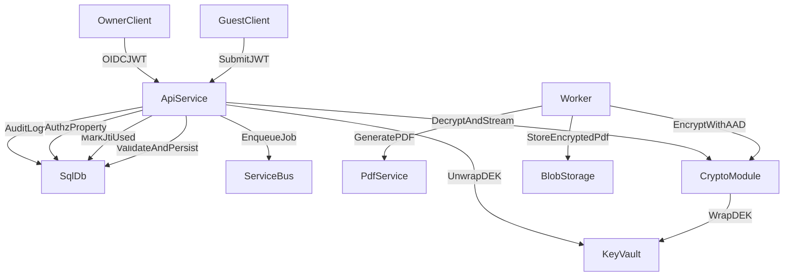

# MVP Secure Backend Plan

## Scope and Assumptions

- The backend does not exist yet in this workspace, so we will scaffold `backend/` with API + worker services and shared libs.
- Guest tokens will be JWTs (MVP default: HS256 with strong shared secret, with a clear path to RS256 later).
- External Azure integrations remain stubbed interfaces but shaped to real SDKs so production wiring is straightforward.

## Key Architecture Updates (MVP-focused)

- Data minimization: store only metadata and encryption fields in SQL; PII stays inside encrypted PDF blob.
- Token security: signed JWT guest tokens with `aud`, `exp`, `iat`, `jti`, `tenantId`, `propertyId`, optional `reservationId`; server-side jti replay protection table.
- Resource authz: enforce property membership on owner access to submissions.
- Crypto hardening: AES-256-GCM with 96-bit nonce, AAD binding to tenantId/propertyId/submissionId/schemaVersion; store nonce/tag/metadata; keep KEK key id/version.
- Idempotent worker: status transitions with retry tracking; verify existing blob state before writing.
- Audit logs: structured events for sensitive actions, written to SQL and optionally to append-only sink.
- Retention: retention policy tables and a scheduled deletion job design.

## Proposed Data Flow

## Files to Create/Update

- Scaffold API/worker project and base setup:
  - `[backend/src/app.ts](/Users/phamhoang/Desktop/Guest registration/backend/src/app.ts)`
  - `[backend/src/routes/registration.ts](/Users/phamhoang/Desktop/Guest registration/backend/src/routes/registration.ts)`
  - `[backend/src/routes/owner.ts](/Users/phamhoang/Desktop/Guest registration/backend/src/routes/owner.ts)`
  - `[backend/src/worker/index.ts](/Users/phamhoang/Desktop/Guest registration/backend/src/worker/index.ts)`
  - `[backend/src/services/crypto.ts](/Users/phamhoang/Desktop/Guest registration/backend/src/services/crypto.ts)`
  - `[backend/src/services/keyVault.ts](/Users/phamhoang/Desktop/Guest registration/backend/src/services/keyVault.ts)`
  - `[backend/src/services/pdf.ts](/Users/phamhoang/Desktop/Guest registration/backend/src/services/pdf.ts)`
  - `[backend/src/services/storage.ts](/Users/phamhoang/Desktop/Guest registration/backend/src/services/storage.ts)`
  - `[backend/src/services/audit.ts](/Users/phamhoang/Desktop/Guest registration/backend/src/services/audit.ts)`
  - `[backend/src/services/authz.ts](/Users/phamhoang/Desktop/Guest registration/backend/src/services/authz.ts)`
  - `[backend/src/services/guestToken.ts](/Users/phamhoang/Desktop/Guest registration/backend/src/services/guestToken.ts)`
  - `[backend/src/middleware/validation.ts](/Users/phamhoang/Desktop/Guest registration/backend/src/middleware/validation.ts)`
  - `[backend/src/middleware/rateLimit.ts](/Users/phamhoang/Desktop/Guest registration/backend/src/middleware/rateLimit.ts)`
  - `[backend/src/middleware/securityHeaders.ts](/Users/phamhoang/Desktop/Guest registration/backend/src/middleware/securityHeaders.ts)`
- Data model and retention:
  - `[backend/src/models/schema.sql](/Users/phamhoang/Desktop/Guest registration/backend/src/models/schema.sql)`
  - `[backend/src/models/rls.sql](/Users/phamhoang/Desktop/Guest registration/backend/src/models/rls.sql)` (optional placeholder)
- Tests and docs:
  - `[backend/tests/crypto.test.ts](/Users/phamhoang/Desktop/Guest registration/backend/tests/crypto.test.ts)`
  - `[backend/tests/authz.test.ts](/Users/phamhoang/Desktop/Guest registration/backend/tests/authz.test.ts)`
  - `[backend/tests/guestToken.test.ts](/Users/phamhoang/Desktop/Guest registration/backend/tests/guestToken.test.ts)`
  - `[infra/azure/README.md](/Users/phamhoang/Desktop/Guest registration/infra/azure/README.md)`

## Implementation Steps

1. Scaffold a Node/Express/TypeScript backend with API + worker entrypoints and shared services.
2. Implement SQL schema with data minimization, encryption metadata, guest token jti tracking, audit logs, and retention policies.
3. Implement guest token JWT verification + jti replay protection + rate limits; add payload validation.
4. Implement crypto utilities: DEK generation, AES-256-GCM encrypt/decrypt with AAD, and Key Vault wrap/unwrap stubs.
5. Implement the worker flow (idempotent): generate PDF, encrypt, wrap DEK, write blob, update DB, audit.
6. Implement owner download with resource-level authz, decrypt-and-stream, and audit events.
7. Add tests for crypto, authz, and guest token replay protection.
8. Update Azure deployment notes and env var list.

## Implementation Todos

- **scaffold-backend**: Create `backend/` with API + worker entrypoints and shared utilities.
- **schema-minimize**: Implement SQL schema with minimal metadata + encryption + audit + jti tracking.
- **token-security**: Add JWT verification + replay protection + rate limiting + validation middleware.
- **crypto-hardening**: Implement AES-256-GCM + AAD + DEK wrap/unwrap stubs.
- **worker-idempotency**: Implement worker flow and status transitions with retries.
- **owner-authz**: Implement property-level authz and secure download route.
- **tests**: Add crypto, authz, and replay protection tests.
- **azure-notes**: Update deployment README with resources and env vars.
