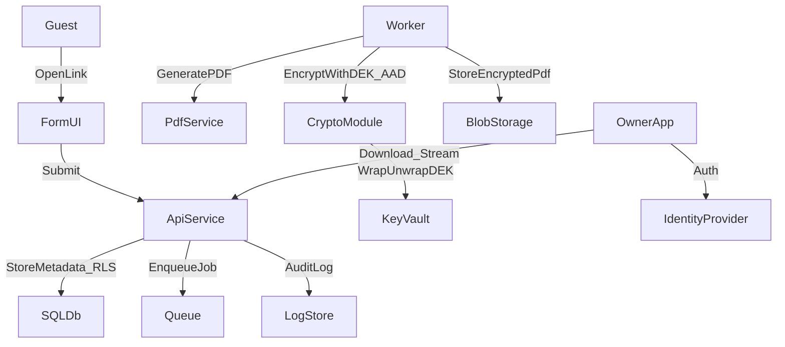

# Guest Registration Platform Plan

## Architecture & Threat Model

- **Cloud target (Azure service picks):**
  - Compute: Azure Container Apps for API; Container Apps Jobs (or a second Container App) for worker.
  - Queue: Azure Service Bus with dead-lettering.
  - DB: Azure SQL (RLS enabled).
  - Storage: Blob Storage for encrypted PDFs; immutable container for audit logs (PDFs optional).
  - Key management: Azure Key Vault Keys (KEK wrap/unwrap) + Managed Identity.
  - Edge: Azure Front Door + WAF.
- **Core services:**
  - API service for registration, validation, RBAC access, and decrypt-and-stream only (no plaintext PDF written to disk).
  - Background worker for PDF generation + encryption.
  - Storage for encrypted PDFs (Blob) and metadata (SQL).
  - Identity & access using JWT (Auth0/Azure AD B2C) for owners/admins; guest tokens for forms.
- **Multi-tenant isolation:** TenantId on every row; tenant-scoped queries **plus Azure SQL RLS**; per-tenant access policies; storage prefix partitioning by TenantId.
- **Threat model summary:**
  - **Data at rest:** Encrypted PDFs using per-record DEK wrapped by Key Vault KEK; store KEK key id + key version per record.
  - **Data in transit:** TLS everywhere; HSTS; **default API streaming** of decrypted PDF; SAS only as optional optimization.
  - **Abuse:** Rate limiting, WAF, bot protection on public forms; CSRF mitigations; CAPTCHA optional.
  - **AuthZ:** Owner access scoped by tenant and property; least privilege; audit logs for access/decrypt actions.
  - **Key compromise:** Key Vault rotation + rewrap strategy; alerting on key usage anomalies; soft delete + purge protection enabled.
  - **Ciphertext swapping:** AES-256-GCM AAD binds tenantId|propertyId|submissionId|schemaVersion.
  - **Network posture:** Private endpoints for SQL/Blob/Key Vault where feasible; disable public access; VNET integration for Container Apps.

## MVP Implementation Plan (Azure)

1. **Project scaffolding & security baseline**

   - Define API service + worker service + shared libraries.
   - Configure dependency management, linting, and CI.
   - Security headers, rate limiting, input validation.

2. **Data model & migrations**

   - Tenants, Properties, Users, Roles, GuestSubmissions, AuditLogs, EncryptionMetadata.
   - Encryption metadata fields: `wrappedDek`, `iv`, `tag`, `kekKeyId`, `kekKeyVersion`, `algo`, `aadVersion`.
   - Add: `aadHash`, `pdfTemplateVersion`, `ciphertextSha256`, `contentType`, `contentLength`.

3. **AuthN/AuthZ**

   - Owner authentication (OIDC) + tenant-scoped RBAC.
   - Guest form tokens (signed, time-limited).

4. **Registration flow**

   - Public form endpoint validates input and stores submission.
   - Queue job for PDF generation + encryption.

5. **Tenant isolation (RLS)**

   - Create `fn_tenantAccessPredicate(tenant_id)` and a security policy on tenant-scoped tables.
   - Set per-request tenant context using `SESSION_CONTEXT` in Azure SQL.
   - Tests that cross-tenant reads are blocked even with bugs in code.

6. **PDF generation + encryption**

   - Generate PDF from structured data.
   - Create random DEK per submission; encrypt PDF using AES-256-GCM.
   - Include AAD: `tenantId|propertyId|submissionId|schemaVersion`.
   - Wrap/unwrap DEK with Key Vault KEK and store wrapped key + metadata.
   - Store `kekKeyId` + `kekKeyVersion` so decrypt uses correct version.
   - Key Vault guardrails: enable soft delete + purge protection; grant wrapKey/unwrapKey/get to Managed Identity.
   - Optional background job to rewrap old DEKs on KEK rotation.

7. **Secure retrieval**

   - Owner API endpoint enforces tenant + property access.
   - Decrypt DEK with Key Vault (unwrap); decrypt PDF and stream.
   - Audit every access and key usage.
   - Default: API decrypt-and-stream (no SAS).
   - Optional: user delegation SAS for encrypted blob download after RBAC (optimization only).

8. **Guest token abuse protection**

   - Add `jti` with used-tracking (one-time or limited reuse).
   - Short TTL aligned with check-in window.
   - Throttling per property.

9. **Network & access posture**

   - Private endpoints for SQL, Blob, and Key Vault where feasible.
   - VNET integration for Container Apps; disable public access as much as possible.

10. **Observability & audit**

   - Structured logs, audit trails, and alerts for sensitive events.
   - Immutable archive for audit logs (Log Analytics + append to immutable Blob).
   - PDFs immutability only if retention/compliance requires it.

11. **Tests & deployment guidance**

   - Unit tests for crypto (AAD), validation, RBAC, and RLS.
   - Integration tests for API + storage.
   - Azure deployment steps (Container Apps, Service Bus, Key Vault, Blob, SQL).

## Suggested execution order

1. define-data-model (include encryption metadata + audit tables)
2. tenant-isolation-rls (early so every query path is forced to comply)
3. authz-flow (JWT + tenant/property RBAC)
4. scaffold-backend + shared libs (validation/audit helpers)
5. crypto-metadata-spec (finalize before coding crypto)
6. pdf-encryption (worker end-to-end: generate → encrypt → store)
7. retrieval-audit (API decrypt & stream + audit)
8. guest-token-replay
9. tests-deploy (+ optional immutability)

## Target Files (to be created/updated)

- `[backend/src/app.ts](/Users/phamhoang/Desktop/Guest registration/backend/src/app.ts)`
- `[backend/src/routes/registration.ts](/Users/phamhoang/Desktop/Guest registration/backend/src/routes/registration.ts)`
- `[backend/src/routes/owner.ts](/Users/phamhoang/Desktop/Guest registration/backend/src/routes/owner.ts)`
- `[backend/src/services/pdf.ts](/Users/phamhoang/Desktop/Guest registration/backend/src/services/pdf.ts)`
- `[backend/src/services/crypto.ts](/Users/phamhoang/Desktop/Guest registration/backend/src/services/crypto.ts)`
- `[backend/src/services/keyVault.ts](/Users/phamhoang/Desktop/Guest registration/backend/src/services/keyVault.ts)`
- `[backend/src/models/schema.sql](/Users/phamhoang/Desktop/Guest registration/backend/src/models/schema.sql)`
- `[backend/src/models/rls.sql](/Users/phamhoang/Desktop/Guest registration/backend/src/models/rls.sql)`
- `[backend/tests/crypto.test.ts](/Users/phamhoang/Desktop/Guest registration/backend/tests/crypto.test.ts)`
- `[backend/tests/rls.test.ts](/Users/phamhoang/Desktop/Guest registration/backend/tests/rls.test.ts)`
- `[infra/azure/README.md](/Users/phamhoang/Desktop/Guest registration/infra/azure/README.md)`

## Deliverables in this Phase

- Architecture + threat model write-up (Azure KMS/Key Vault).
- MVP API design + data model.
- Code snippets for RLS, crypto AAD, Key Vault wrap/unwrap, and RBAC checks.
- Tests and deployment guidance (with SAS decision and immutability option).