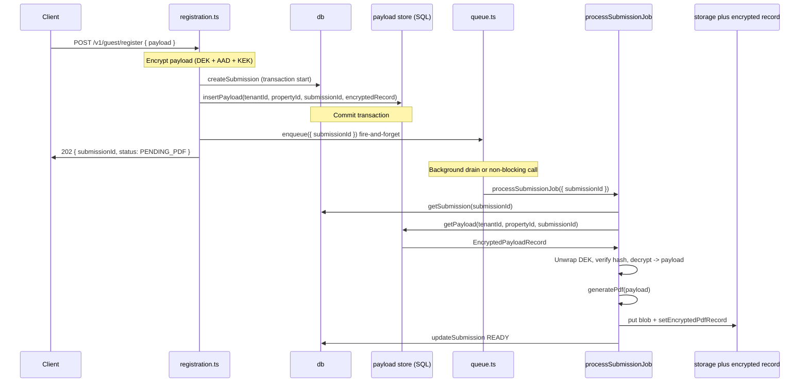

# Payload-to-worker and queue (core flow) — Revised

## Updated approach summary

1. **Storage:** SQL table `submission_payloads` is the source of truth. Add missing columns for full encryption metadata (nonce, tag, wrapped_dek, kek_key_id, kek_key_version, aad_version, schema_version, ciphertext_sha256). Implement real DB methods to insert/read by `(tenantId, propertyId, submissionId)`. An in-memory adapter implementing the same interface is used only in tests.

2. **Payload encryption:** No single static env key. Use the same design as the PDF flow: per-submission random DEK, AES-256-GCM, AAD with `purpose: "payload"` and `{ aadVersion, tenantId, propertyId, submissionId, schemaVersion, cryptoVersion }`, and wrap the DEK with the existing Azure Key Vault KEK adapter (RSA-OAEP-256). Persist all crypto fields in `submission_payloads`.

3. **Queue:** Messages contain only `{ submissionId }`. MVP is fire-and-forget: do not await PDF generation. In-process MVP either (a) push to an in-memory queue drained by a background loop, or (b) call `processSubmissionJob` without awaiting and ensure worker errors update `submissions.last_error`, `status = FAILED`, and audit (already partially done in worker).

4. **Worker:** Job type is `{ submissionId }` only. When `job.payload` is absent, load encrypted payload from SQL and decrypt. Optional compatibility: if `job.payload` is present (e.g. legacy tests), use it; otherwise load from DB. Document migration; update tests to use DB-backed path.

5. **Transactions and errors:** Create submission and insert encrypted payload in one DB transaction where feasible; enqueue after commit. If encryption or storage fails, mark submission `FAILED`, set `last_error`, and write an audit event. Avoid zombie submissions (no PENDING_PDF without a stored payload or without a job enqueued).

6. **Scope:** Limited to the payload path and queue trigger (Step 1). No RLS, token issuance, listing, or other features.

---

## Implementation plan

### 1. Schema: `submission_payloads` columns

- **File:** [backend/src/models/schema.sql](backend/src/models/schema.sql) (or a migration file if the repo uses migrations).
- **Existing:** `submission_payloads(submission_id, tenant_id, property_id, payload_ciphertext, created_at)`.
- **Add columns** so the table stores full encryption metadata and matches the payload encryption design:
  - `nonce` VARBINARY(12) NOT NULL
  - `tag` VARBINARY(16) NOT NULL
  - `wrapped_dek` VARBINARY(500) NOT NULL
  - `kek_key_id` NVARCHAR(200) NOT NULL
  - `kek_key_version` NVARCHAR(100) NOT NULL
  - `aad_version` INT NOT NULL DEFAULT 1
  - `schema_version` INT NOT NULL DEFAULT 1
  - `ciphertext_sha256` CHAR(64) NOT NULL
- Keep `payload_ciphertext` VARBINARY(MAX) for the AES-GCM ciphertext. Ensure lookup by `(tenant_id, property_id, submission_id)` uses primary key or existing index (submission_id is PK).

### 2. Payload AAD and encryption (aligned with PDF crypto)

- **AAD for payload:** Define a distinct AAD schema for payload (separate from PDF AAD). Include `purpose: "payload"` and `{ aadVersion, tenantId, propertyId, submissionId, schemaVersion, cryptoVersion }`. Reuse canonical JSON from [backend/src/crypto/aad.ts](backend/src/crypto/aad.ts) (`canonicalizeJson`).
- **New:** Add `buildPayloadAadBytes(input: { aadVersion, tenantId, propertyId, submissionId, schemaVersion, cryptoVersion })` in [backend/src/crypto/aad.ts](backend/src/crypto/aad.ts) (or a dedicated payload AAD helper) returning `Buffer`.
- **Payload encrypt/decrypt:** New module e.g. [backend/src/services/payloadEncryption.ts](backend/src/services/payloadEncryption.ts). Uses `generateDek`, `encryptAesGcm`, `decryptAesGcm` from [backend/src/crypto/aesgcm.ts](backend/src/crypto/aesgcm.ts), `buildPayloadAadBytes`, `hashNonceCiphertextTagHex` from [backend/src/crypto/hashes.ts](backend/src/crypto/hashes.ts), and the existing **Key Vault KEK adapter** from [backend/src/crypto/keyVaultKek.ts](backend/src/crypto/keyVaultKek.ts) for wrap/unwrap. No `PAYLOAD_ENCRYPTION_KEY`.
  - **Encrypt:** Plaintext (JSON string) → DEK → AES-GCM with AAD → nonce, ciphertext, tag; wrap DEK with KEK; compute ciphertext_sha256; return a record `{ nonce, tag, ciphertext, wrappedDek, kekKeyId, kekKeyVersion, aadVersion, schemaVersion, ciphertextSha256Hex }`.
  - **Decrypt:** Load record from DB → unwrap DEK → verify ciphertext_sha256 → decrypt with AAD → return plaintext string.
- **Constants:** Use same `CRYPTO_VERSION` and AAD/schema versions as the rest of the app (e.g. 1).

### 3. Payload store interface and implementations

- **Interface:** Define `PayloadStore` with:
  - `insertPayload(tenantId: string, propertyId: string, submissionId: string, record: EncryptedPayloadRecord): Promise<void>`
  - `getPayload(tenantId: string, propertyId: string, submissionId: string): Promise<EncryptedPayloadRecord | null>`
- **Type:** `EncryptedPayloadRecord` holds `nonce`, `tag`, `ciphertext`, `wrappedDek`, `kekKeyId`, `kekKeyVersion`, `aadVersion`, `schemaVersion`, `ciphertextSha256Hex` (and optionally `contentLength` if useful).
- **SQL implementation:** Implement a real DB client (e.g. `pg`, `better-sqlite3`, or the project’s chosen driver) that inserts/reads from `submission_payloads` by `(tenant_id, property_id, submission_id)`. Wire this as the default in production.
- **In-memory implementation:** Implement `InMemoryPayloadStore` (Map keyed by submissionId or composite key) for tests only. Include in `reset()` / test setup.
- **Wiring:** [backend/src/services/db.ts](backend/src/services/db.ts) (or a separate store factory) exports the payload store used by the app; tests inject the in-memory store.

### 4. Registration: transaction, encrypt, store, enqueue (fire-and-forget)

- **File:** [backend/src/routes/registration.ts](backend/src/routes/registration.ts).
- **Flow:**
  1. Validate token and body as today; create `submissionId`.
  2. **Transaction (where feasible):** In one transaction: `createSubmission(...)` and `payloadStore.insertPayload(tenantId, propertyId, submissionId, encryptedRecord)`. If the DB layer does not support transactions, document the ordering and do best-effort (create submission first, then insert payload; on insert failure, update submission to FAILED and audit).
  3. **Encryption:** Before or inside the transaction: serialize `req.body.payload` to JSON; call payload encryption (per-submission DEK + AAD + KEK wrap) to produce `EncryptedPayloadRecord`. If encryption fails → do not create submission, or create with status FAILED and `last_error` + audit.
  4. **After commit:** Call `enqueue({ submissionId })` (fire-and-forget). Do not await the worker.
  5. Respond `202` with `{ submissionId, status: "PENDING_PDF" }`.
- **Error handling:** If encryption or `insertPayload` fails, set submission status to `FAILED`, `last_error` to the error message, and write an audit event. Do not enqueue.

### 5. Queue abstraction (fire-and-forget, submissionId only)

- **File:** [backend/src/services/queue.ts](backend/src/services/queue.ts).
- **Job type:** `{ submissionId: string }` only. No payload in the message.
- **`enqueue(job: { submissionId: string }): Promise<void>`:** Resolves once the job is accepted, not when PDF is ready.
- **MVP implementation (in-process):** Either:
  - **Option (a):** Push `job` onto an in-memory queue; a background loop (e.g. `setInterval` or a single `process.nextTick` drain) calls `processSubmissionJob(job)` without awaiting. Errors are already handled inside `processSubmissionJob` (updates `last_error`, status FAILED, audit).
  - **Option (b):** Call `processSubmissionJob(job)` without awaiting (e.g. `void processSubmissionJob(job)` or `.catch(...)` to log). Ensure any unhandled rejection is captured and reflected in submission state (worker already updates FAILED and audit).
- Document that a real queue will push only `{ submissionId }` and that the request must not block on PDF generation.

### 6. Worker: load and decrypt payload from DB when `job.payload` absent

- **File:** [backend/src/worker/processSubmission.ts](backend/src/worker/processSubmission.ts).
- **Job type:** Prefer `{ submissionId: string }` only. For backward compatibility during migration: allow optional `job.payload`; if present, use it; if absent, load from payload store and decrypt.
- **Load path:** Get submission from DB; get `(tenantId, propertyId, submissionId)` from submission; call `payloadStore.getPayload(tenantId, propertyId, submissionId)`; if null, set submission FAILED, set `last_error`, audit, and return. Otherwise decrypt using the payload decryption helper (unwrap DEK, verify hash, decrypt with AAD); parse JSON to `RegistrationSubmission`; call `generatePdf(payload, ...)` and continue the existing PDF + encrypt flow.
- **Tests:** Update tests to use the DB-backed path (insert encrypted payload into the store, then call `processSubmissionJob({ submissionId })`). Document the temporary compatibility path and remove it once tests are migrated.

### 7. No change to PDF encryption or owner flow

- Existing PDF generation, blob storage, `EncryptedPdfRecord`, and owner download flow remain unchanged. Worker still uses `generatePdf`, then encrypts the PDF with its own DEK and KEK as today.

---

## Patch-style checklist (file-by-file)

| File | Change |
|------|--------|
| [backend/src/models/schema.sql](backend/src/models/schema.sql) | Add to `submission_payloads`: `nonce VARBINARY(12) NOT NULL`, `tag VARBINARY(16) NOT NULL`, `wrapped_dek VARBINARY(500) NOT NULL`, `kek_key_id NVARCHAR(200) NOT NULL`, `kek_key_version NVARCHAR(100) NOT NULL`, `aad_version INT NOT NULL DEFAULT 1`, `schema_version INT NOT NULL DEFAULT 1`, `ciphertext_sha256 CHAR(64) NOT NULL`. |
| [backend/src/crypto/aad.ts](backend/src/crypto/aad.ts) | Add payload AAD schema and `buildPayloadAadBytes(input)` with `purpose: "payload"` and `aadVersion`, `tenantId`, `propertyId`, `submissionId`, `schemaVersion`, `cryptoVersion`. |
| New: [backend/src/services/payloadEncryption.ts](backend/src/services/payloadEncryption.ts) | Encrypt: DEK + AES-GCM + AAD + KEK wrap; return EncryptedPayloadRecord. Decrypt: unwrap DEK, verify ciphertext_sha256, decrypt. Use existing aesgcm, hashes, keyVaultKek. |
| New (or extend): payload store | Define `PayloadStore` interface and `EncryptedPayloadRecord` type. Implement SQL implementation (insert/read by tenantId, propertyId, submissionId). Implement `InMemoryPayloadStore` for tests. |
| [backend/src/services/db.ts](backend/src/services/db.ts) | Integrate payload store: add or wire `insertPayload` / `getPayload` (delegate to SQL or in-memory adapter). For tests, expose or inject in-memory adapter; in production use SQL. If the repo has no SQL client yet, add a minimal one for submission_payloads only and keep in-memory as fallback for dev/tests. |
| [backend/src/services/queue.ts](backend/src/services/queue.ts) | New. Export `enqueue(job: { submissionId: string })` (fire-and-forget). MVP: in-memory queue + background drain, or `void processSubmissionJob(job)` with error handling. Document contract. |
| [backend/src/routes/registration.ts](backend/src/routes/registration.ts) | After token validation: create submission + encrypt payload + insert payload in one transaction (or ordered steps with failure → FAILED + audit). Enqueue `{ submissionId }` after commit; do not await. On encrypt/store failure: submission FAILED, last_error, audit. Return 202. |
| [backend/src/worker/processSubmission.ts](backend/src/worker/processSubmission.ts) | Job type `{ submissionId: string }` (optional `payload` for compat). If no `job.payload`: get submission, then `getPayload(tenantId, propertyId, submissionId)`, decrypt, parse JSON, then generatePdf(payload, ...). Update tests to DB-backed path. |

---

## Acceptance criteria (updated)

| Criterion | How it’s met |
|-----------|--------------|
| POST /v1/guest/register with valid token and `{ payload }` results in a job enqueued with that payload (payload in DB, job has only submissionId) | Registration encrypts payload (per-submission DEK + AAD + KEK), stores in `submission_payloads` (SQL), then enqueues `{ submissionId }` fire-and-forget. Worker loads payload from SQL by (tenantId, propertyId, submissionId) and decrypts. |
| Payload encryption matches PDF design (no single static key) | Per-submission DEK, AES-256-GCM, AAD with purpose "payload", KEK wrap via existing Key Vault adapter. All fields stored in submission_payloads. |
| Request does not block on PDF generation | enqueue is fire-and-forget; 202 returned after enqueue, not after worker completion. |
| Worker runs generatePdf(payload, ...) and completes with READY, blob and encrypted record | Worker loads/decrypts payload from DB when job.payload absent; rest of pipeline unchanged. |
| Owner can download PDF for that submission | Unchanged; owner route uses submission status and blob/record. |
| No zombie submissions | Transaction or ordered create + insert payload; on failure, submission marked FAILED with last_error and audit. Enqueue only after successful store. |
| SQL is source of truth for payloads; in-memory only for tests | submission_payloads table used by real DB methods; in-memory adapter only in test setup. |

---

## Updated mermaid diagram

---

## Risks / notes (max 10)

- **No SQL client in repo today:** Current [backend/src/services/db.ts](backend/src/services/db.ts) is in-memory only. Implementing “real DB methods” requires introducing a DB client and possibly a small abstraction (e.g. PayloadStore interface with SQL + in-memory implementations). Plan assumes adding a minimal client for `submission_payloads` and wiring it; in-memory remains for tests and optional local dev.
- **Transaction scope:** If the chosen DB client supports transactions, wrap createSubmission + insertPayload in one transaction. If not (e.g. multiple services), use ordered steps and on payload insert failure mark submission FAILED and audit; do not enqueue.
- **Fire-and-forget in-process:** If the worker throws before updating DB, ensure rejections are caught (e.g. `.catch` on the promise or a drain loop) so they can be reflected in submission state; worker already sets FAILED and last_error on catch.
- **Payload AAD versioning:** Use a dedicated payload AAD schema (e.g. `payloadAadVersion: 1`) so future changes do not collide with PDF AAD. Include purpose `"payload"` to bind context.
- **KEK reuse:** Same Key Vault KEK adapter is used for both PDF DEK and payload DEK; key rotation affects both. Acceptable for MVP; document for future key-per-purpose if needed.
- **Schema migration:** Adding columns to `submission_payloads` may require a migration strategy (e.g. ALTER in a migration file) and backfill if the table already has data.
- **Test compatibility:** Allowing `job.payload` when present keeps existing tests running during migration; update tests to insert encrypted payload and call with `{ submissionId }` only, then optionally remove the compatibility path.
- **Idempotency:** Worker already skips when status is READY and handles FAILED/retries. No change required for idempotency.
- **Scope boundary:** No RLS, token issuance, or listing endpoints; only registration → payload store → queue → worker → PDF ready path.
- **Order of operations:** Enqueue only after successful commit of submission + payload to avoid jobs that reference a submission with no payload row.
